## ⚡ About Me

## 🛠️ Tech Stack

 

## 📊 GitHub Stats

## 🐍 Contributions

<picture>
  <source media="(prefers-color-scheme: dark)" srcset="https://raw.githubusercontent.com/dj-dev-jsx/dj-dev-jsx/output/github-snake-dark.svg" />
  <source media="(prefers-color-scheme: light)" srcset="https://raw.githubusercontent.com/dj-dev-jsx/dj-dev-jsx/output/github-snake.svg" />
  
</picture>

## 🌐 Connect

  <code>while (alive) { learn(); build(); }</code>

